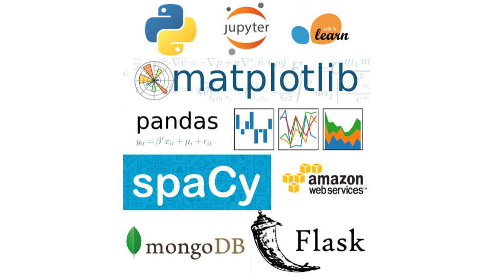
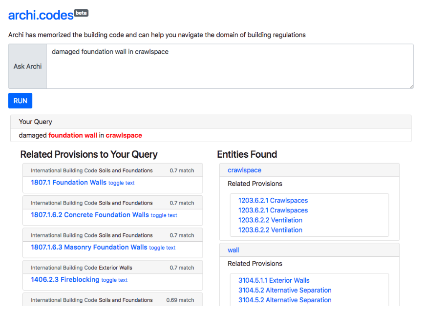
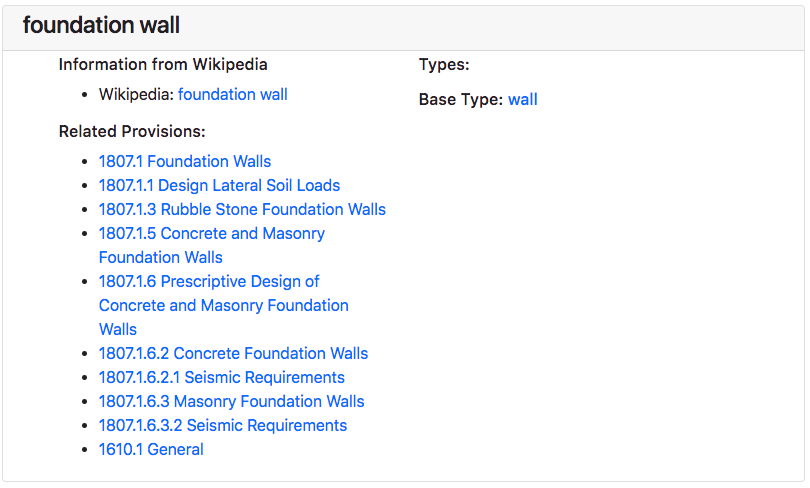
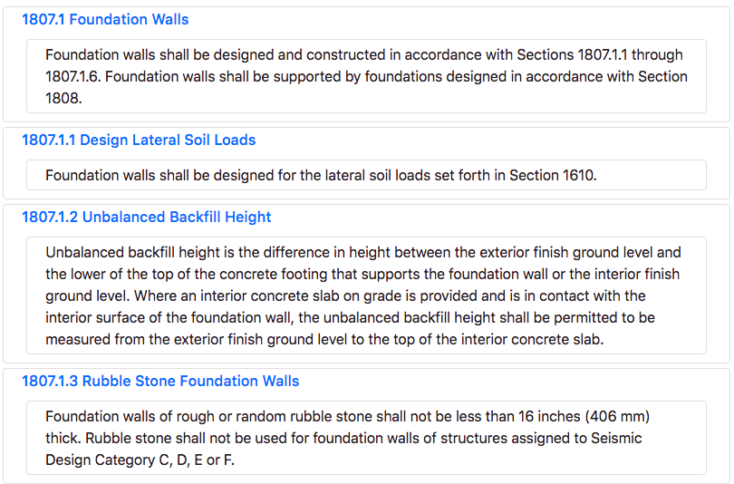

# [archi.codes](http://www.archi.codes)

## TOC

1. [About](#about)
2. [Procedure](#procedure)
3. [Tech Stack](#tech-stack)
4. [Web Application](#web-application)

## About
***NLP and knowledge graphs for AEC using spaCy***

archi.codes is an application that can help architects, engineers, and contractors quickly navigate through multiple building code documents and find the relevant information for their design and work. archi.codes uses the spaCy NLP model to analyze the text from building code documents and generates knowledge graphs from this information. Knowledge graphs will be the first step towards automated compliance checking and will lead to higher efficiency in the construction industry.

## Procedure
1. Collect text data and split provisions into rows of data.
2. Run the spaCy NLP model on the text and extract keywords.
3. Construct knowledge graph from and part-of-speech and dependency-parsed data.
  * **Nodes** include provisions and components
  * Nodes are connected by **edges** which include the following:
    * provision relates to other provision
    * component type of other component
    * provision applies to component
5. Deploy data on a Flask web application at (archi.codes)[www.archi.codes]

## Tech Stack

## Web Application

The application returns two outputs:
  * provisions related directly to the entire query
  * extracts components and provisions related to the components

#### Component View

#### Provision View

